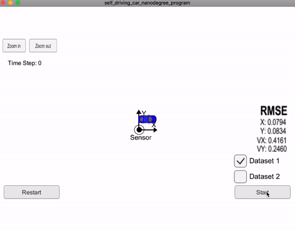

# submission Unscented Kalman Filter Project Starter Code
Self-Driving Car Engineer Nanodegree Program
## GOAL:

  utilize an Unscented Kalman Filter to estimate the state of a moving object of interest with noisy lidar and radar measurements. Passing the project requires obtaining RMSE values that are lower that the tolerance outlined in the project rubric. 

### all the code about the EKF is in the ./src

## my demo

### Tracking Accuracy

------

Algorithm performance on dataset 1 & 2 are as follows:

| Dataset  | RMSE[px, py, vx, vy]             |
| -------- | -------------------------------- |
| Dataset1 | [0.0795, 0.0852, 0.3636, 0.2264] |
| Dataset2 | [0.0794, 0.0834, 0.4161, 0.2460] |

Which meets the required accuracy.

